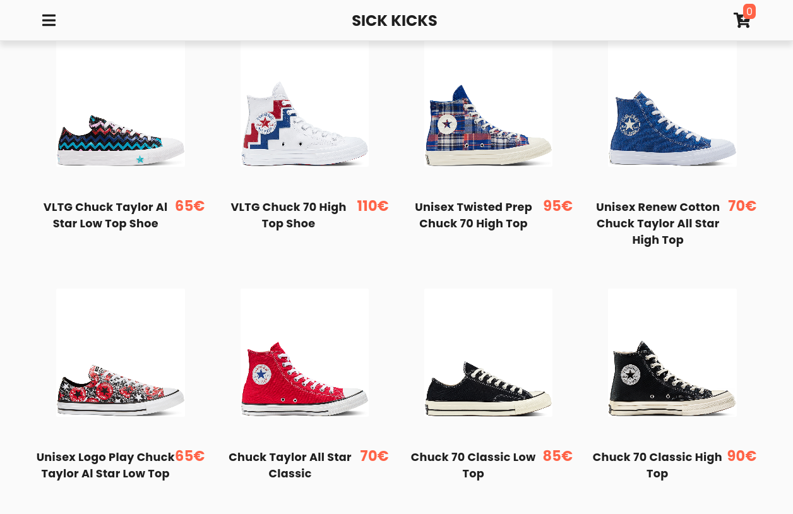

# Sick Kicks



Sick Kicks is a fictional frontend e-commerce shop for buying fresh kicks.

It uses [Contentful](https://www.contentful.com/) as a headless CMS to fetch and populate data.

The `src/products.json` is for displaying dummy data. It can be used by placing the same file in the `dist` folder that's created by running Parcel with `yarn dev`. The `src/images` folder also needs to be included there. Avoid CORS error by running it on a server, or use `require/import`.

```js
const result = await fetch(`products.json`);
const data = await result.json();

let products = data.items;
```
